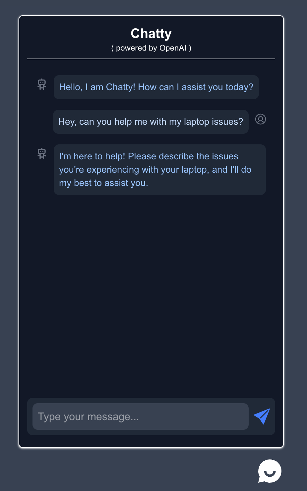

# 🗨️ Chatty AI

**Chatty AI** is an intelligent, always-on assistant built with the OpenAI Chat Completion API. It answers your questions instantly using a combination of retrieval-augmented generation (RAG) and LLM reasoning — whether you're looking for information or just want to chat.

---

## 🚀 Features

- 💬 Natural, human-like conversations using OpenAI Chat API (GPT-o4-mini)
- 🧠 **RAG-based pipeline**: Answers are first retrieved from a knowledge base for accuracy and speed
- 🪄 Falls back to LLM generation when no known answer is found
- 🧵 Persistent, contextual conversation flow
- ⚡️ Fast and responsive UI with Next.js + Tailwind CSS
- 🛠️ Built with scalability and extensibility in mind

---

## 📸 Screenshots & GIFs (Add These)

| Type                | Description                                      |
|---------------------|--------------------------------------------------|
| 💬 Chat Interface    | |
| 🔍 RAG in Action     |  |
| 🤖 LLM fallback      | ![LLM generation using openAI] (./docs/llm-generation.mov)|


---

## ⚙️ Getting Started

```bash
# Clone the repo
git clone https://github.com/PriyaBarnwal/Chatty-AI.git
cd chatty-ai

# Install dependencies
npm install

# Create a .env.local file and add:
# OPENAI_API_KEY=your-key-here
# ENDPOINT_URL=https://your-resource.openai.azure.com
# OPENAI_DEPLOYMENT_NAME=gpt-4o-mini
# API_VERSION=2024-02-15-preview

# Run the app
npm run dev

Visit http://localhost:3000 to start chatting.


